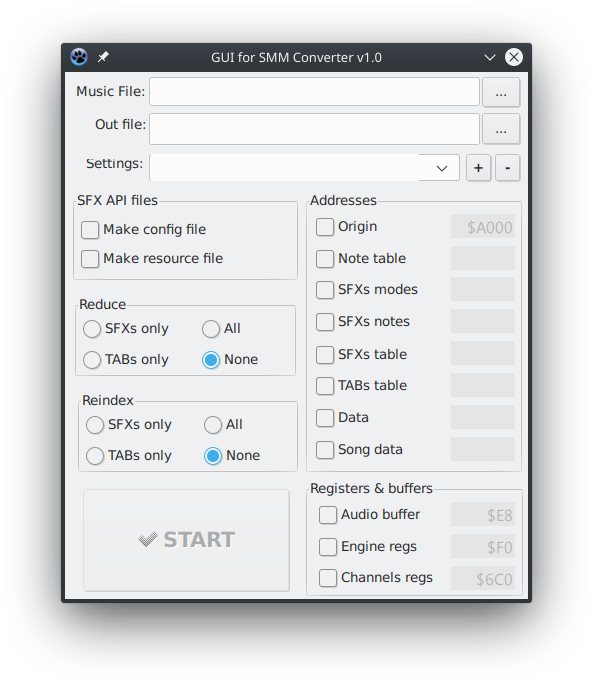

# GUI dla programu SMM Converter

Program jest nakładką graficzną na program [SMM-CONV](https://github.com/GSoftwareDevelopment/SFX-Engine/tree/main/smm-conv).

Program powstał w środowisku **Lazarus Free Pascal**, dzięki czemu można skompilować go na wiele platform sprzętowych, jak i systemów operacyjnych.

