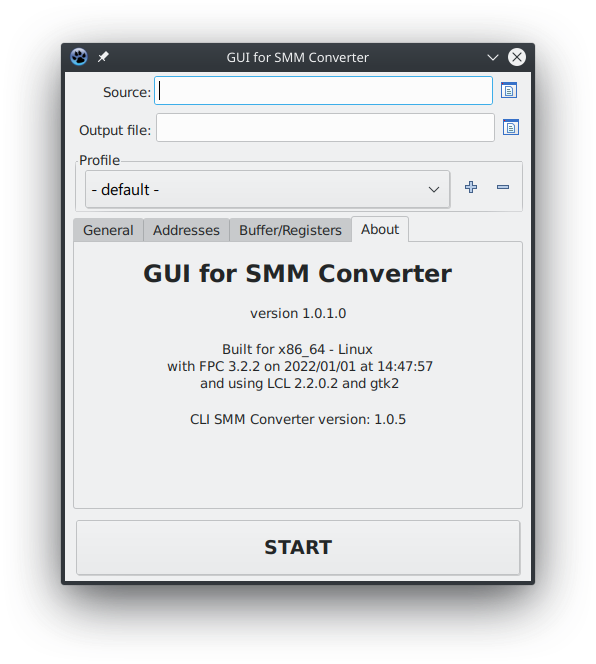
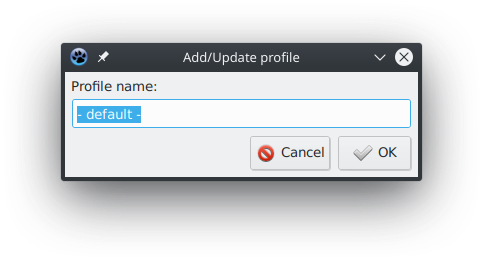
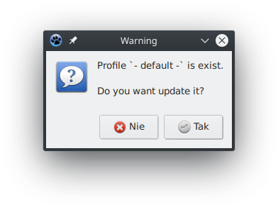
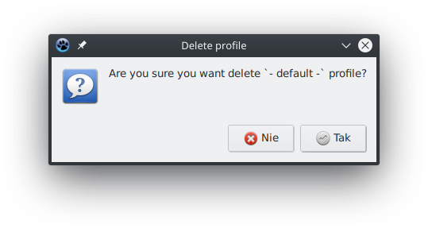
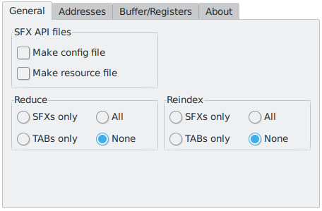
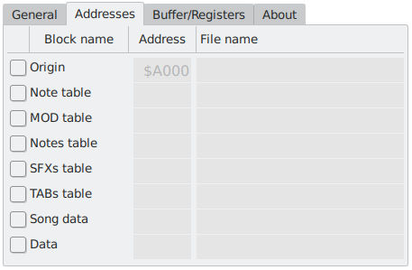
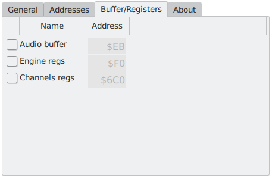
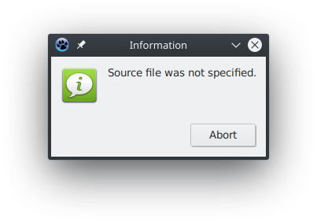
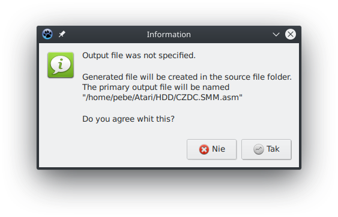
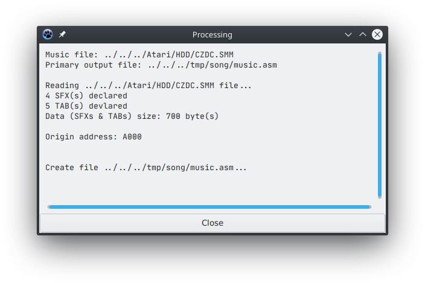

# Główne okno programu

Wszystkie opcje programu są zawarte w jednym oknie

Można go podzielić na cztery grupy:

- Parametry podstawowe
- Profile konfiguracyjne
- Aktualna konfiguracja
- Start procesu konwersji

## Parametry podstawowe

### Source

Ustala plik źródłowy do przetworzenia.

Plik musi być zgodny z formatem **SMM**, czyli **SFX Music Maker (aka SFX Tracker)**

### Output file

Określa podstawowy plik wyjściowy. Jest on powiązany z blokiem danych **Origin**, umieszczonym w zakładce **Addresses** konfiguracji profilu.

Plikiem wynikowym jest źródło w **assemblerze** o domyślnym rozszerzeniu `.asm`

## Profile

Umożliwia proste zarządzanie profilami poprzez **listę wyboru** oraz możliwość **tworzenia nowych** profili, ich **aktualizacji** oraz **usuwania istniejących** profili.

W profilu zapisywane są wszystkie definiowane w konfiguracji parametry.

### Przycisk `+`

#### Tworzenie profilu

Aby utworzyć nowy profil, należy go uprzednio skonfigurować. Następnie klikając w **przycisk plus** (umieszczony po prawej stronie listy wyboru profili) należy podać nazwę tworzonego profilu.

#### Aktualizacja profilu

Aktualizacji można dokonać podając istniejącą nazwę profilu przy jego tworzeniu. Użytkownik zostanie poinformowany monitem _"Profil o podanej nazwie istnieje"_ i pytaniu, _"Czy chcesz go zaktualizować?"_

Odpowiadając **Tak**, dokonasz aktualizacji konfiguracji profilu.

### Przycisk `-`

#### Usuwanie profilu

Usunięcie profilu należy zacząć od jego wybrania z **listy wyboru profili**, po czym, należy nacisnąć **przycisk minus**. Pojawi się monit z pytaniem _"Czy usunąć profil?"_.

Odpowiadając twierdząco, usuniesz go.

Po tej operacji, bieżąca konfiguracja nie zostanie zmieniona.

## Konfiguracja

Jest to grupa zakładek **General**, **Addresses** oraz **Buffer/Registers** w których znajdują się odpowiednio pogrupowane opcje konfiguracyjne dt. konwersji.

W tej części zawarta jest jeszcze zakładka **About**, czyli informacje o programie.

### General

### SFX API files

Grupa pozwalająca ustalić, jakie pliki dla **SFX API** mają być wygenerowane przez konwerter.

- **Make config file** - to plik zawierający definicje stałych wykorzystywanych przez **SFX-Engine** oraz **SFX API** dla **MAD Pascala**
- **Make resource file** - plik z definicjami zasobów dla **MAD Pascala**

#### Reduce

Pozwala określić, jakie dane będą poddane redukcji, poprzez eliminacje elementów nieużywanych.

Elementy które mogą być poddane redukcji to definicje **SFXów** oraz **TABów**.

#### Reindex

W tej grupie można określić, które dane będą poddane **reindeksacji**.

**Reindeksacja** pozwala oszczędzić miejsce w pamięci Atari, poprzez kompaktowe umieszczenie elementów. Wyeliminowanie luk (ang. Gaps) w tablicach pozwala je skrócić.

Elementy jakie mogą być poddane reindeksacji to definicje **SFXów** oraz **TABów**.

### Addresses

Zakładka pozwala określić, rozmieszczenie bloków danych w pamięci Atari.

- **Origin** - podstawowy blok danych (opisany pod listą)
- **Note table** - blok danych zawierający definicje tablic nut
- **Mod table** - użyte modulatory w SFXach
- **Notes table** - przypisane tablice nut dla SFXów
- **SFXs table** - tablica wskaźników dla definicji SFXów
- **TABs table** - j.w. tylko dla TABów
- **Song data** - definicja utworu (SONG)
- **Data** - definicje SFXów oraz TABów

Szczególnym rodzajem bloku, jest blok **Origin**, który jest podstawowym blokiem danych, tzn. w przypadku niezdefiniowania adresów innych bloków to właśnie w nim, będą umieszczane dane.

Dla każdego bloku danych, można określić jego adres początkowy, określając go w kolumnie **Address**. Można w tym celu użyć zapisu dziesiętnego lub szesnastkowego. Dla rozróżnienia tego zapisu, stosowany jest symbol dolara `$` lub prefix `0x` na początku adresu.

W przypadku niepodania adresu początkowego lub podania wartości zero `0`, blok danych będzie dołączony do bloku **Origin**, kontynuując jego adres.

Określenie nazwy pliku dla danego bloku, pozwoli wygenerować dla niego osobny plik, jednak, gdy jego adres nie będzie określony, tak się nie stanie.

Generowany plik, będzie umieszczony w katalogu, który jest określony w **Output file**; lub w przypadku jego nieokreślenia w **Output file**, w katalogu który wyznacza **Source**

### Buffer/Registers

Silnik SFX-Engine pozwala na ustalenie adresów dla rejestrów roboczych (**Engine regs**) rejestrów kanałów (**Channels regs**) oraz bufora rejestrów POKEY w skrócie nazwanego buforem audio (**Audio Buffer**)

**Audio buffer** oraz **Channels regs** mogą być umieszczone w dowolnym obszarze pamięci RAM komputera ATARI, jednak należy zwrócić uwagę na fakt, że umieszczenie ich poza stroną zerową (zero page) zwiększy obciążenie generowane przez silnik.

Dodatkowo **Audio buffer** można określić jako wyłączony, poprzez ustawienie jego adresu na zero `0`.

**Engine regs** to rejestr który może być alokowany Tylko na stronie zerowej, czyli komórki od 0 do 255 ($00-$FF)

### About

W tej zakładce znajdują się informacje dt. **aktualnie używanej wersji nakładki GUI**, **informacje o kompilacji** oraz **wersja używanego programu SMM Converter**.

**Nakładka GUI** jest dostarczana z dostosowaną do niej wersją programu **SMM Converter**.

Program nie wykrywa opcji konfiguracji jakie pozwala ustawić program **SMM Converter**!

## Start

Przycisk **START** pozwala rozpocząć proces konwersji. Uruchamia on program `smm-conv` wraz z odpowiednimi parametrami.

Brak ustalenia **pliku źródłowego**, poskutkuje wyświetleniem stosownego monitu:

W przypadku, gdy nie zostanie określony **plik wyjściowy**, monit ten będzie następujący:

Znaczy on tyle, że wszystkie pliki, jakie będzie generował konwerter, będą umieszczone w katalogu pliku źródłowego.

### Okno Processing

Po skończonej pracy programu `smm-conv`, wyświetlane jest okno dialogowe z informacjami jakie konwerter zwrócił.

